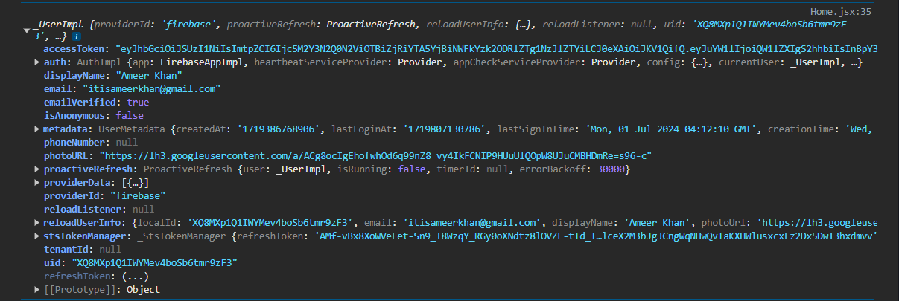

# 📍 AUTHENTICATION

<div align="center">

</div>

> /config/firebase.js

```js
import { initializeApp } from "firebase/app";
import { getAuth } from "firebase/auth";

const firebaseConfig = {
  apiKey: "*****",
  authDomain: "*****",
  projectId: "*****",,
  storageBucket: "*****",,
  messagingSenderId: "*****",,
  appId: "*****",
  measurementId: "*****",
};

const app = initializeApp(firebaseConfig);
export const auth = getAuth(app); // <-- INITIALISE AUTH
```

`getAuth` is a function provided by the Firebase Authentication module that initializes and returns an `Auth` instance for the provided Firebase app. This instance allows you to interact with Firebase Authentication services, such as signing in users, managing user accounts, and handling authentication states

---

## 🔥 USAGE OF AUTH INSTANCE

With the `Auth` instance, you can now perform various authentication operations, such as signing in users, signing out users, and managing user states

## 🔥 `createUserWithEmailAndPassword`

For a user to sign up on our application with their email address and password, we must pass the user’s credentials to the `createUserWithEmailAndPassword` function imported from the `firebase/auth` subpackage. This function creates a new user account in our Firebase project and sets the user’s initial password.

The `createUserWithEmailAndPassword` function takes three arguments. The first argument is the `auth` object that represents the initialized `auth` instance. Then, it takes the `email` and `password` values that we obtain from our client-side input fields. This function is asynchronous and takes some time to complete. Therefore, we can attach a JavaScript promise (Text in the key: The Promise object represents the eventual completion (or failure) of an asynchronous operation and its resulting value.) that allows us to handle the function’s success value or failure reason.

### ⚡How It Works

When you call `createUserWithEmailAndPassword`, Firebase Authentication will:

1. **Validate the Email and Password**: Ensure that the email address is properly formatted and the password meets any specified requirements.

2. **Create a New User Account**: If the email and password are valid, Firebase will create a new user account in the Firebase Authentication system.

3. **Return a UserCredential Object**: Upon successful account creation, the function returns a `UserCredential` object that contains information about the newly created user, including the user's unique ID (UID), email, and other profile information.

```jsx
import { createUserWithEmailAndPassword } from "firebase/auth";
import { auth } from "config/firebase";

const handleSignIn = async () => {
  try {
    const response = await createUserWithEmailAndPassword(
      auth,
      email,
      password
    );
    console.log(response.user);
  } catch (e) {
    console.log(e);
  }
};
```

### ⚡ Parameters

1. `auth`: The Auth instance associated with your Firebase app. This is typically obtained using `getAuth()`.

2. `email`: A string representing the user's email address.

3. `password`: A string representing the user's password.

> [!IMPORTANT]
> When a user signs up for our application, they are automatically signed in and a new user account is created under the Firebase project that links to their credentials. This user account identifies the user across all applications in the project, regardless of the sign-in method.

---

## 🔥 `signInWithEmailAndPassword`

The steps for signing in a user with an email and password are similar to those for creating a new user with an email and password. To sign in a user with an email and password, we pass the user’s credentials to the `signInWithEmailAndPassword` function:

```js
try {
  const response = await signInWithEmailAndPassword(
    auth,
    data.email,
    data.password
  );
  console.log(response);
} catch (e) {
  console.log(e.code);
  console.log(e.message);
}
```

---

## 🔥 HANDLING ERRORS

During the login or signup process, it is possible for users to input wrong data that might trigger errors that lead to unhandled exception situations. Therefore, we need to handle possible errors appropriately. Firebase offers a way to handle possible authentication errors regardless of the sign-in method. This list of errors exists on the `AuthErrorCodes` object, imported from the `firebase/auth` subpackage. Handling errors this way allows us to display better, user-readable error messages on our application:

```js
try {
  const response = await createUserWithEmailAndPassword(
    auth,
    data.email,
    data.email
  );
} catch (e) {
  if (e.code === AuthErrorCodes.EMAIL_EXISTS) {
    console.log("EMAIL ALREADY EXISTS");
  }
}
```

A map of potential `Auth` error codes, for easier comparison with errors thrown by the SDK.

Note that you can't tree-shake individual keys in the map, so by using the map you might substantially increase your bundle size.

```js
AUTH_ERROR_CODES_MAP_DO_NOT_USE_INTERNALLY: {
    readonly ADMIN_ONLY_OPERATION: "auth/admin-restricted-operation";
    readonly ARGUMENT_ERROR: "auth/argument-error";
    readonly APP_NOT_AUTHORIZED: "auth/app-not-authorized";
    readonly APP_NOT_INSTALLED: "auth/app-not-installed";
    readonly CAPTCHA_CHECK_FAILED: "auth/captcha-check-failed";
    readonly CODE_EXPIRED: "auth/code-expired";
    readonly CORDOVA_NOT_READY: "auth/cordova-not-ready";
    readonly CORS_UNSUPPORTED: "auth/cors-unsupported";
    readonly CREDENTIAL_ALREADY_IN_USE: "auth/credential-already-in-use";
    readonly CREDENTIAL_MISMATCH: "auth/custom-token-mismatch";
    readonly CREDENTIAL_TOO_OLD_LOGIN_AGAIN: "auth/requires-recent-login";
    readonly DEPENDENT_SDK_INIT_BEFORE_AUTH: "auth/dependent-sdk-initialized-before-auth";
    readonly DYNAMIC_LINK_NOT_ACTIVATED: "auth/dynamic-link-not-activated";
    readonly EMAIL_CHANGE_NEEDS_VERIFICATION: "auth/email-change-needs-verification";
    readonly EMAIL_EXISTS: "auth/email-already-in-use";
    readonly EMULATOR_CONFIG_FAILED: "auth/emulator-config-failed";
    readonly EXPIRED_OOB_CODE: "auth/expired-action-code";
    readonly EXPIRED_POPUP_REQUEST: "auth/cancelled-popup-request";
    readonly INTERNAL_ERROR: "auth/internal-error";
    readonly INVALID_API_KEY: "auth/invalid-api-key";
    readonly INVALID_APP_CREDENTIAL: "auth/invalid-app-credential";
    readonly INVALID_APP_ID: "auth/invalid-app-id";
    readonly INVALID_AUTH: "auth/invalid-user-token";
    readonly INVALID_AUTH_EVENT: "auth/invalid-auth-event";
    readonly INVALID_CERT_HASH: "auth/invalid-cert-hash";
    readonly INVALID_CODE: "auth/invalid-verification-code";
    readonly INVALID_CONTINUE_URI: "auth/invalid-continue-uri";
    readonly INVALID_CORDOVA_CONFIGURATION: "auth/invalid-cordova-configuration";
    readonly INVALID_CUSTOM_TOKEN: "auth/invalid-custom-token";
    readonly INVALID_DYNAMIC_LINK_DOMAIN: "auth/invalid-dynamic-link-domain";
    readonly INVALID_EMAIL: "auth/invalid-email";
    readonly INVALID_EMULATOR_SCHEME: "auth/invalid-emulator-scheme";
    readonly INVALID_IDP_RESPONSE: "auth/invalid-credential";
    readonly INVALID_LOGIN_CREDENTIALS: "auth/invalid-credential";
    readonly INVALID_MESSAGE_PAYLOAD: "auth/invalid-message-payload";
    readonly INVALID_MFA_SESSION: "auth/invalid-multi-factor-session";
    readonly INVALID_OAUTH_CLIENT_ID: "auth/invalid-oauth-client-id";
    readonly INVALID_OAUTH_PROVIDER: "auth/invalid-oauth-provider";
    readonly INVALID_OOB_CODE: "auth/invalid-action-code";
    readonly INVALID_ORIGIN: "auth/unauthorized-domain";
    readonly INVALID_PASSWORD: "auth/wrong-password";
    readonly INVALID_PERSISTENCE: "auth/invalid-persistence-type";
    readonly INVALID_PHONE_NUMBER: "auth/invalid-phone-number";
    readonly INVALID_PROVIDER_ID: "auth/invalid-provider-id";
    readonly INVALID_RECIPIENT_EMAIL: "auth/invalid-recipient-email";
    readonly INVALID_SENDER: "auth/invalid-sender";
    readonly INVALID_SESSION_INFO: "auth/invalid-verification-id";
    readonly INVALID_TENANT_ID: "auth/invalid-tenant-id";
    readonly MFA_INFO_NOT_FOUND: "auth/multi-factor-info-not-found";
    readonly MFA_REQUIRED: "auth/multi-factor-auth-required";
    readonly MISSING_ANDROID_PACKAGE_NAME: "auth/missing-android-pkg-name";
    readonly MISSING_APP_CREDENTIAL: "auth/missing-app-credential";
    readonly MISSING_AUTH_DOMAIN: "auth/auth-domain-config-required";
    readonly MISSING_CODE: "auth/missing-verification-code";
    readonly MISSING_CONTINUE_URI: "auth/missing-continue-uri";
    readonly MISSING_IFRAME_START: "auth/missing-iframe-start";
    readonly MISSING_IOS_BUNDLE_ID: "auth/missing-ios-bundle-id";
    readonly MISSING_OR_INVALID_NONCE: "auth/missing-or-invalid-nonce";
    readonly MISSING_MFA_INFO: "auth/missing-multi-factor-info";
    readonly MISSING_MFA_SESSION: "auth/missing-multi-factor-session";
    readonly MISSING_PHONE_NUMBER: "auth/missing-phone-number";
    readonly MISSING_SESSION_INFO: "auth/missing-verification-id";
    readonly MODULE_DESTROYED: "auth/app-deleted";
    readonly NEED_CONFIRMATION: "auth/account-exists-with-different-credential";
    readonly NETWORK_REQUEST_FAILED: "auth/network-request-failed";
    readonly NULL_USER: "auth/null-user";
    readonly NO_AUTH_EVENT: "auth/no-auth-event";
    readonly NO_SUCH_PROVIDER: "auth/no-such-provider";
    readonly OPERATION_NOT_ALLOWED: "auth/operation-not-allowed";
    readonly OPERATION_NOT_SUPPORTED: "auth/operation-not-supported-in-this-environment";
    readonly POPUP_BLOCKED: "auth/popup-blocked";
    readonly POPUP_CLOSED_BY_USER: "auth/popup-closed-by-user";
    readonly PROVIDER_ALREADY_LINKED: "auth/provider-already-linked";
    readonly QUOTA_EXCEEDED: "auth/quota-exceeded";
    readonly REDIRECT_CANCELLED_BY_USER: "auth/redirect-cancelled-by-user";
    readonly REDIRECT_OPERATION_PENDING: "auth/redirect-operation-pending";
    readonly REJECTED_CREDENTIAL: "auth/rejected-credential";
    readonly SECOND_FACTOR_ALREADY_ENROLLED: "auth/second-factor-already-in-use";
    readonly SECOND_FACTOR_LIMIT_EXCEEDED: "auth/maximum-second-factor-count-exceeded";
    readonly TENANT_ID_MISMATCH: "auth/tenant-id-mismatch";
    readonly TIMEOUT: "auth/timeout";
    readonly TOKEN_EXPIRED: "auth/user-token-expired";
    readonly TOO_MANY_ATTEMPTS_TRY_LATER: "auth/too-many-requests";
    readonly UNAUTHORIZED_DOMAIN: "auth/unauthorized-continue-uri";
    readonly UNSUPPORTED_FIRST_FACTOR: "auth/unsupported-first-factor";
    readonly UNSUPPORTED_PERSISTENCE: "auth/unsupported-persistence-type";
    readonly UNSUPPORTED_TENANT_OPERATION: "auth/unsupported-tenant-operation";
    readonly UNVERIFIED_EMAIL: "auth/unverified-email";
    readonly USER_CANCELLED: "auth/user-cancelled";
    readonly USER_DELETED: "auth/user-not-found";
    readonly USER_DISABLED: "auth/user-disabled";
    readonly USER_MISMATCH: "auth/user-mismatch";
    readonly USER_SIGNED_OUT: "auth/user-signed-out";
    readonly WEAK_PASSWORD: "auth/weak-password";
    readonly WEB_STORAGE_UNSUPPORTED: "auth/web-storage-unsupported";
    readonly ALREADY_INITIALIZED: "auth/already-initialized";
    readonly RECAPTCHA_NOT_ENABLED: "auth/recaptcha-not-enabled";
    readonly MISSING_RECAPTCHA_TOKEN: "auth/missing-recaptcha-token";
    readonly INVALID_RECAPTCHA_TOKEN: "auth/invalid-recaptcha-token";
    readonly INVALID_RECAPTCHA_ACTION: "auth/invalid-recaptcha-action";
    readonly MISSING_CLIENT_TYPE: "auth/missing-client-type";
    readonly MISSING_RECAPTCHA_VERSION: "auth/missing-recaptcha-version";
    readonly INVALID_RECAPTCHA_VERSION: "auth/invalid-recaptcha-version";
    readonly INVALID_REQ_TYPE: "auth/invalid-req-type";
}
```

---

## 🔥 `onAuthStateChanged`

### ⚡ Set an authentication state observer and get user data

For each of your app's pages that need information about the signed-in user, attach an observer to the global authentication object. This observer gets called whenever the user's sign-in state changes.

Attach the observer using the `onAuthStateChanged` method. When a user successfully signs in, you can get information about the user in the observer.

`onAuthStateChanged` is a method provided by Firebase that you can use to monitor the authentication state of a user. It helps in determining if a user is currently logged in or logged out and can be particularly useful for applications where user authentication status is crucial, such as those with personalized content or restricted access. In a React application, you typically use this method within a useEffect hook to keep track of the user's authentication state in real-time.

### ⚡ Explanation

- **Purpose**: `onAuthStateChanged` sets an observer on the Auth object to get the current user state. Whenever the user's authentication state changes, this observer is triggered. This is useful for determining if a user is logged in or out, and to update the UI accordingly.

- **Usage**: You use it within a useEffect hook to run the observer when the component mounts and clean up when the component unmounts.

- **Parameters**: It takes a callback function that receives the user object if the user is logged in, or null if the user is logged out.

> Home.jsx

```jsx
import { auth } from "../../config/firebase";
import { onAuthStateChanged } from "firebase/auth";
```

> Home.jsx

```jsx
useEffect(() => {
  const unsubscribe = onAuthStateChanged(auth, (user) => {
    if (user) {
      console.log(user.uid);
      console.log(user.email);
    } else {
      console.log("user not logged in.");
    }
  });

  return () => {
    unsubscribe();
  };
}, []);
```

> [!IMPORTANT]
> when you call the `unsubscribe` function returned by onAuthStateChanged, it automatically stops listening for authentication state changes. This is essential for cleaning up the observer and preventing memory leaks when your component unmounts.

1. **`onAuthStateChanged`**: This function registers an observer for changes to the user's sign-in state. It returns an unsubscribe function that you can call to remove the observer.

2. **`unsubscribe`**: When called, this function unregisters the observer, stopping any further updates to your callback when the authentication state changes.

> [!IMPORTANT] > `onAuthStateChanged` in Firebase is not an asynchronous function. It registers an observer that gets called whenever the user's sign-in state changes.

**`onAuthStateChanged` is used to set up a listener that triggers a callback function whenever there is a change in the user's authentication state. It can detect when a user signs in, signs out, or when their token is refreshed.**

### ⚡ KEY POINTS

1. **Non-async**: `onAuthStateChanged` is not an asynchronous function. It immediately registers the observer and returns an unsubscribe function.

2. **Real-time Updates**: The callback passed to `onAuthStateChanged` is called immediately with the current authentication state and whenever the authentication state changes.

3. **Proper Cleanup**: Always ensure to remove the observer by calling the unsubscribe function returned by `onAuthStateChanged` in your cleanup function within `useEffect`.

---

## ⚡ GET A USER'S PROFILE

```jsx
import { auth } from "./config/firebase";
```

```jsx
const userData = auth.currentUser;
```



---

## ⚡ UPDATE A USER'S PROFILE

`updateProfile` function in Firebase Authentication allows you to update the `displayName` and `photoURL` properties of the current user. It does not allow you to update the user's `email`, `password`, or other profile attributes directly.

```jsx
import { getAuth, updateProfile } from "firebase/auth";
const auth = getAuth();
updateProfile(auth.currentUser, {
  displayName: "Jane Q. User",
  photoURL: "https://example.com/jane-q-user/profile.jpg",
})
  .then(() => {
    // Profile updated!
    // ...
  })
  .catch((error) => {
    // An error occurred
    // ...
  });
```

---